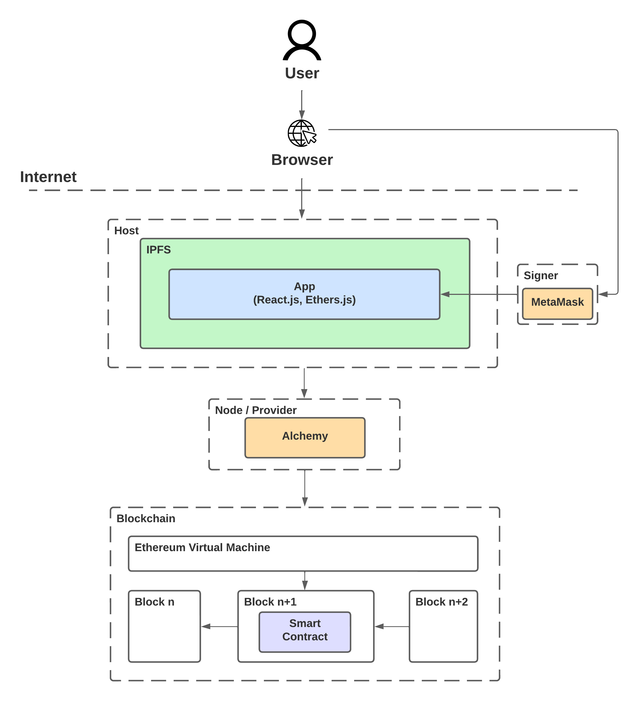
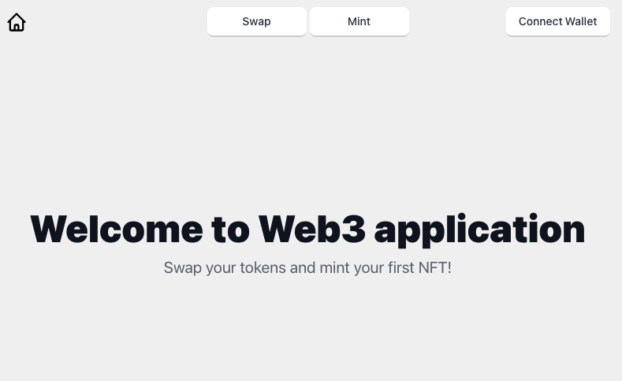
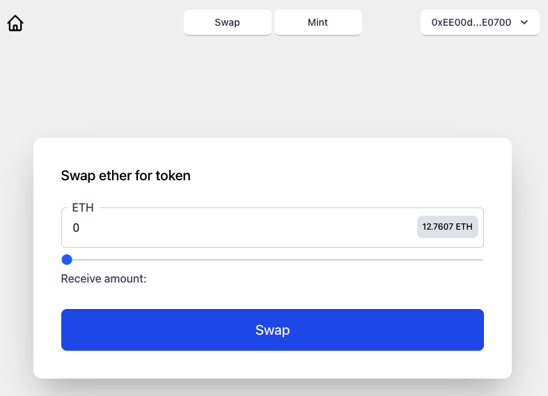
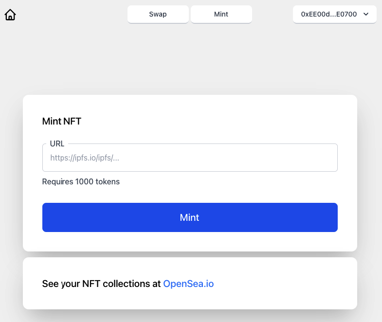

# Web3 Application

### This project is a Web3 application that interact with Ethereum [Smart Contracts](https://ethereum.org/en/developers/docs/smart-contracts/).

It lets user swap tokens using [Uniswap](https://uniswap.org/) exchange [liquidity pool](https://docs.uniswap.org/protocol/V2/concepts/core-concepts/pools) and use it to mint [NFT](https://en.wikipedia.org/wiki/Non-fungible_token) token.

## Web3 architecture

## User interface

- Main page

- Swap token

- Mint NFT

 

# Project structure

## app

This is a client application that interacts with deployed Smart Contracts.

### Tech stack

- [React.js](https://reactjs.org/) - Library for building user interfaces
- [Tailwind CSS](https://tailwindcss.com/) - CSS framework
- [WAGMI](https://wagmi.sh/) - React hooks to interact with wallets and smart contracts. Built on top of [Ethers.js](https://docs.ethers.io/v5/)

### Functionalities

- Swap ether to dedicated token using Uniswap created pool
- Mint NFT token

### Development

- `npm run start`

## eth

This directory contains Smart Contracts implementations and deployment scripts.

### Tech stack

- [Solidity](https://docs.soliditylang.org/en/v0.8.14/)
- [Hardhat](https://hardhat.org/)

### Functionalities

- ERC20 token contract
- ERC721 token contract
- Contract that uses the above and provides additional functionalities
  - Swap ether to dedicated token
  - Mint an NFT for that token

### Development

- compile: `npm run compile`
- deploy: `npm run deploy-[local|rinkeby]`

  Before verify step you need to include contract addresses in `arguments.js` file.

- verify: `npx hardhat verify --network rinkeby --constructor-args arguments.js <address>`

### Already deployed contracts' addresses are available in `app` directory in public `.env` file.
